## Định Nghĩa

Economy Balance Dashboard là bộ 11 chart chuẩn để phân tích kinh tế puzzle game, được mô tả trong tài liệu hướng dẫn của XGAME. Mục tiêu chính là theo dõi sự cân bằng giữa **Earn** (nguồn kiếm soft currency) và **Sink** (nguồn tiêu thụ), phát hiện sớm hai trạng thái nguy hiểm: **inflation** (Earn > Sink kéo dài, người chơi tích trữ tiền không cần mua) và **choke point** (Sink > Earn, người chơi thiếu tiền không tiến được).

Dashboard chia 11 chart thành ba lớp granularity: tổng thể (chart 1–3), theo progression level (chart 4–9), và theo time period (chart 10–11). Soft currency mặc định trong tài liệu là **Gold**.

## Mục Đích Dashboard

Theo tài liệu, dashboard phục vụ ba mục đích quyết định: điều chỉnh reward level, điều chỉnh cost của booster và revive, tối ưu vòng lặp kinh tế tổng thể. Phát hiện ba vấn đề cần can thiệp: level có nguy cơ thiếu tiền (hard level / choke point), level bơm tiền quá nhiều (inflation risk), và nguồn earn/sink mất cân bằng. Phân tích theo ba dimension: level, user segment, thời gian.

## 11 Chart Phân Tích

### 1. Resource Earn per User

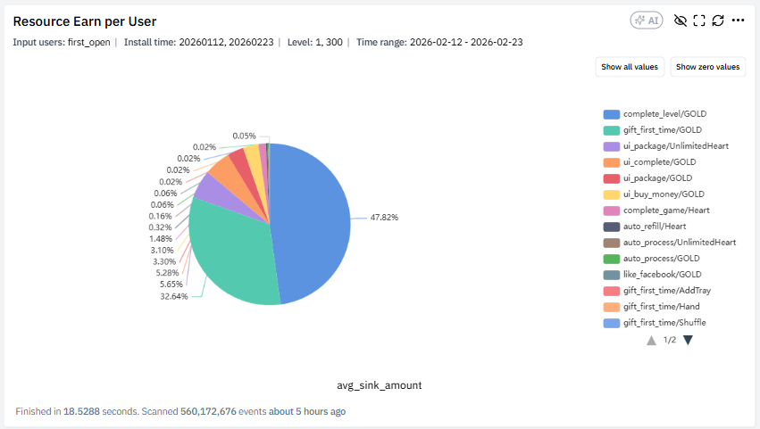

Phân tích cơ cấu nguồn Earn trung bình trên mỗi user — người chơi kiếm Gold chủ yếu từ đâu. Metric: `Earn per User = Tổng Earn / Tổng User`. Đọc dạng stacked bar hoặc pie chart, quan sát nguồn nào chiếm tỷ trọng lớn nhất và có nguồn nào tăng bất thường theo thời gian không. Câu hỏi điều tra: game có phụ thuộc quá nhiều vào 1 nguồn earn không, có dấu hiệu inflation từ reward không, event có làm bơm tiền quá mạnh không.

### 2. Resource Sink per User

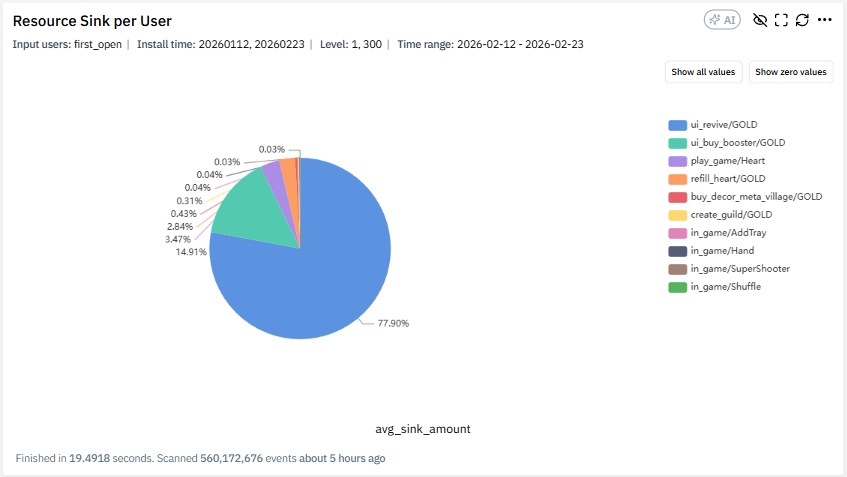

Phân tích cơ cấu tiêu tiền trung bình trên mỗi user. Metric: `Sink per User = Tổng Sink / Tổng User`. So sánh tỷ trọng từng nguồn Sink, xác định nguồn chiếm phần lớn tiêu tiền, đối chiếu giữa các version hoặc cohort. Câu hỏi điều tra: booster có phải sink chính không, revive có tăng ở mid-game không, có sink nào gần như không được sử dụng không, game có thiếu cơ chế tiêu tiền không. Liên hệ trực tiếp với [[booster-design-puzzle|booster design]] và [[hard-level-design|hard level]] (nơi revive trigger).

### 3. Soft Currency Income & Spend – Whole Economy

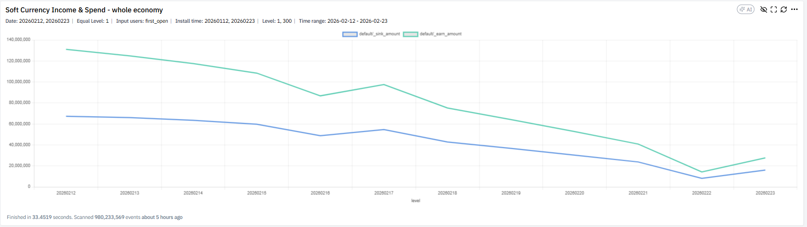

Đánh giá cân bằng kinh tế tổng thể theo thời gian. Metric: `Total Income = Tổng Earn theo ngày`, `Total Spend = Tổng Sink theo ngày`, `Balance = Earn - Sink`. Quy tắc đọc: Income > Spend liên tục → inflation; Spend > Income → người chơi thiếu tiền. Tài liệu nhấn mạnh quan sát xu hướng dài hạn, không chỉ 1–2 ngày. Câu hỏi điều tra: economy có cân bằng không, có giai đoạn shock sau update không, có ngày event gây bơm tiền quá mạnh không.

### 4. Median Sum of Soft Currency Gained/Spent at Start of Each Level

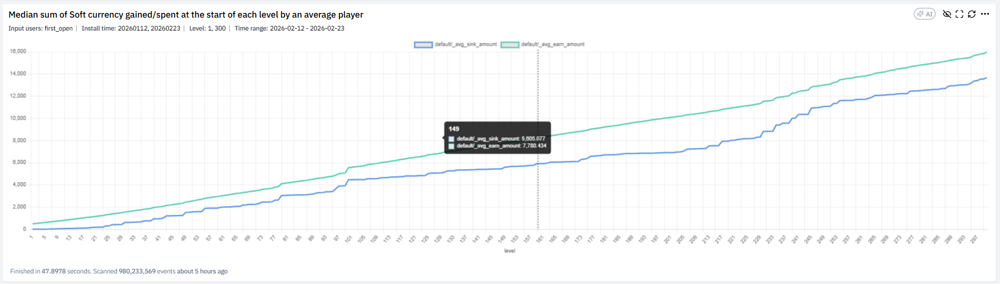

Hiểu lượng Gold tích lũy theo progression của median player. Metric: `Median cumulative Earn` (vàng nhận tích lũy theo level), `Median cumulative Spend` (vàng tiêu tích lũy theo level). Đọc bằng cách so sánh độ dốc hai đường — Spend dốc hơn Earn cảnh báo thiếu tiền, Earn dốc hơn nhiều cảnh báo inflation mid-game. Câu hỏi: người chơi bắt đầu thiếu tiền ở level nào, mid-game có bị choke không, early game có bơm tiền quá mạnh không.

### 5. Soft Currency Earn/Sink at Start of Each Level

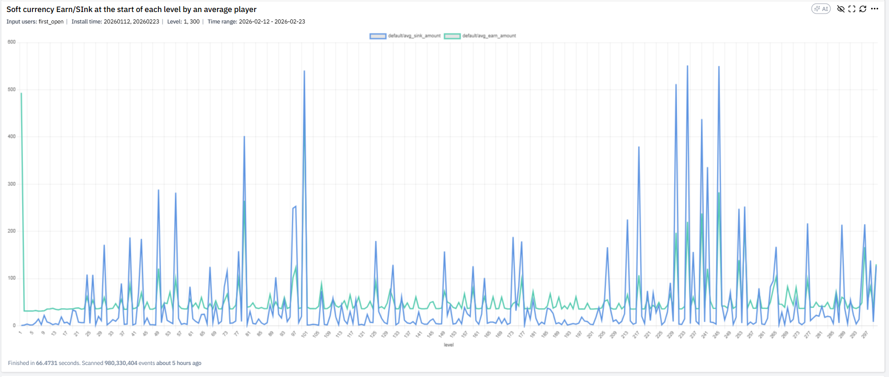

Phát hiện spike Earn/Sink tại từng level cụ thể. Metric: `Earn` (tài nguyên nhận tại level), `Sink` (tài nguyên dùng tại level). Quan sát level có spike chi phí, so sánh Earn vs Sink từng level. Câu hỏi: level nào quá tốn tiền, level nào reward bất thường, có level spike gây drop không.

### 6. Earn for Soft Currency by Level

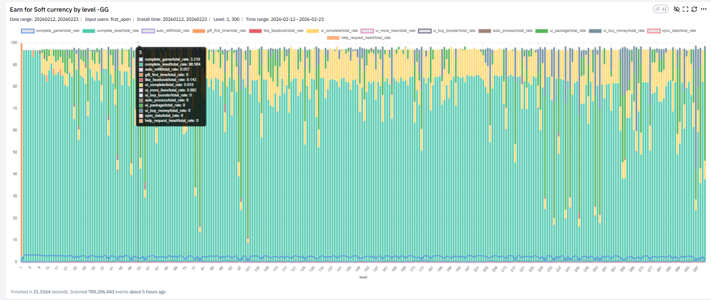

Earn breakdown theo source tại từng level (Complete level, Ads, Event…). Đọc dạng stacked bar, so sánh tỷ trọng Complete vs Ads vs Event qua các level. Câu hỏi: reward level có tăng hợp lý không, ads reward có lấn át gameplay reward không, event reward có làm inflation ở mid-game không.

### 7. Sink for Soft Currency by Level

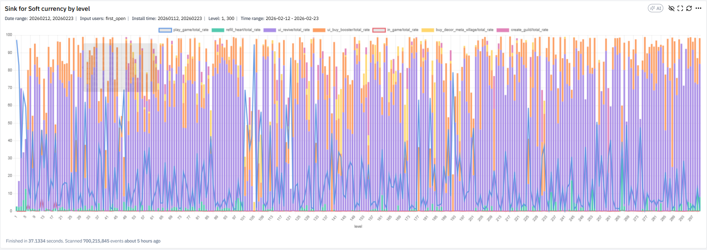

Sink breakdown theo source tại từng level. Quan sát booster spike ở level nào, revive có tăng ở level khó không. Câu hỏi: level nào gây tốn booster nhiều nhất, có level design gây frustration không, cost tuning có hợp lý không. Chart này đặc biệt quan trọng để verify rằng [[hard-level-design|hard level design]] đang hoạt động đúng — sink phải spike tại hard level.

### 8. Amount of Soft Currency When Starting a Level

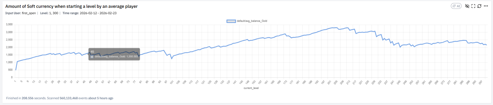

Theo dõi balance khi player bắt đầu level. Metric: Average Gold và Median Gold khi bắt đầu level. Quan sát xu hướng tăng/giảm theo progression, tìm điểm tụt mạnh. Câu hỏi: người chơi có đủ tiền để tiếp tục không, có level nào làm tụt balance mạnh không, có dấu hiệu tích trữ quá nhiều tiền không.

### 9. Amount of Soft Currency When Starting a Level – Segmented

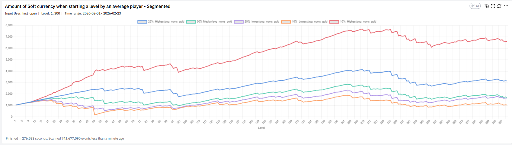

So sánh phân hóa giàu nghèo các nhóm user. Metric: Gold start level theo Top 10%, Top 25%, Bottom 10%, Bottom 25%. So sánh khoảng cách giữa Top và Bottom, quan sát gap mở rộng hay thu hẹp theo level. Câu hỏi: chênh lệch có quá lớn không, Bottom có bị choke không, có cần cơ chế catch-up không.

### 10. Sources for Soft Currency (Selected Time)

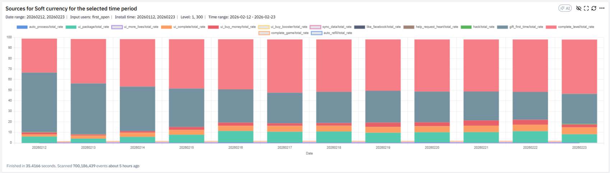

Phân tích tỷ trọng Earn trong một khoảng thời gian. Metric: % contribution theo source và Total Earn trong period. So sánh tỷ trọng giữa các nguồn và đối chiếu với giai đoạn trước. Câu hỏi: event có làm tăng earn không, có nguồn earn bất thường tăng đột biến không, có cần điều chỉnh reward không.

### 11. Sinks for Soft Currency (Selected Time)

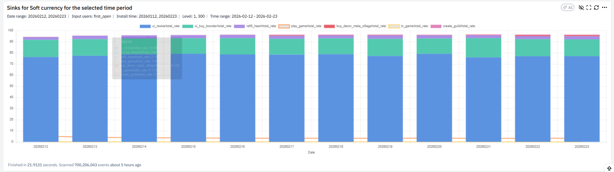

Phân tích tỷ trọng Sink theo thời gian. Metric: % Sink theo source và Total Sink trong period. Quan sát nguồn tiêu chính, so sánh trước/sau update. Câu hỏi: booster usage có tăng không, revive có chiếm tỷ trọng lớn không, monetization pressure có tăng không.

## Liên Hệ / Ứng Dụng

Dashboard này là công cụ verification thực tế cho các nguyên tắc level design đã có trong wiki. [[hard-level-design|Hard level]] được tài liệu Lion Studios mô tả là "currency sink để trigger booster/revive" — chart 5 và chart 7 chính là nơi kiểm chứng giả thuyết đó: nếu hard level được thiết kế đúng, sink phải spike tại đúng các level đó. Tương tự, [[easy-level-design|easy level]] không nên là nơi reward bùng nổ — chart 6 phải cho thấy reward phân bố cân đối, không lệch về easy level.

Dashboard cũng minh hoạ hai phương pháp trong [[metric-diagnosis-4-methods|4 phương pháp chẩn đoán chỉ số]]: chart 9 (segmented quartile) là ví dụ điển hình của Method 2 (bóc tách dimension), chart 3 (Income vs Spend whole economy) áp dụng Method 4 (so sánh tham chiếu — earn so với sink baseline). Khi áp dụng [[game-analytics-mindset|quy trình 6 bước]], dashboard này thuộc Bước 5 (phân tích & ra action) cho mục tiêu cân bằng kinh tế.

Cảnh báo quan trọng từ tài liệu: "Quan sát xu hướng dài hạn, không chỉ 1–2 ngày" — đặc biệt áp dụng cho chart 3 và chart 8 nơi noise ngày-qua-ngày dễ gây hiểu nhầm.

## Nguồn Tham Khảo

- `raw/papers/XGAME_DA_ Hướng dẫn đọc phân tích các chart trong dashboard_Economy.pdf` — XGAME DA dashboard guide, 10 trang
- Ảnh minh hoạ trích xuất từ PDF, lưu tại `economy-balance-dashboard.assets/`
