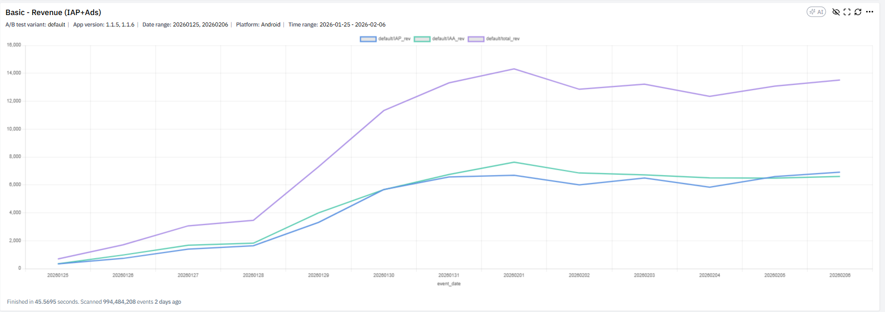
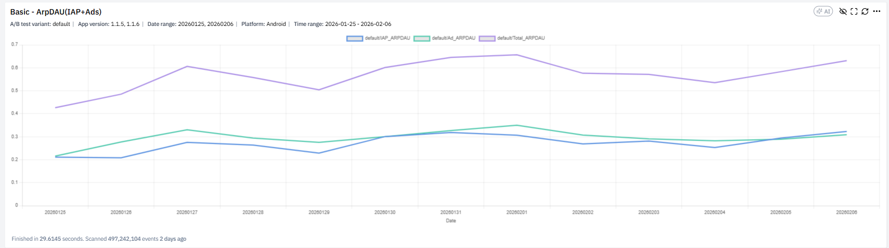
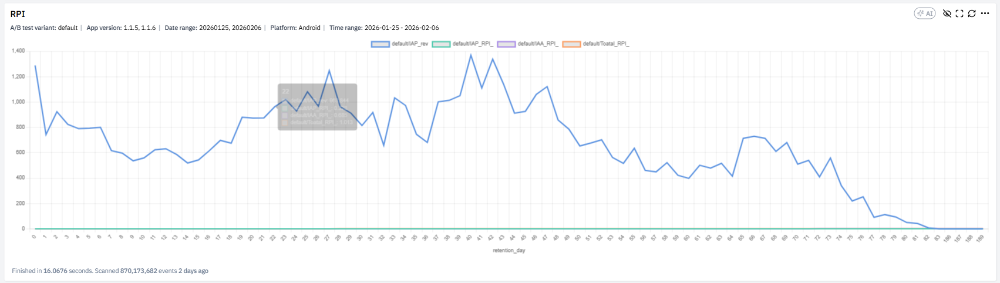
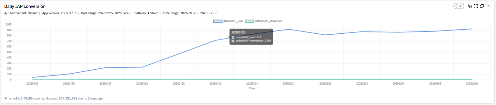
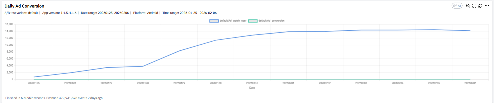
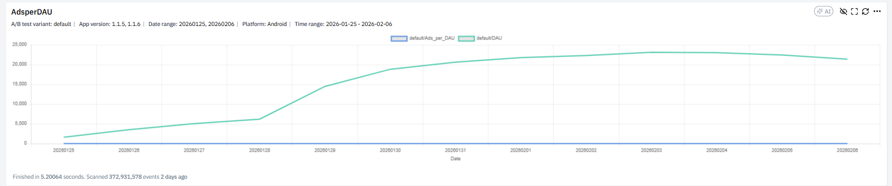
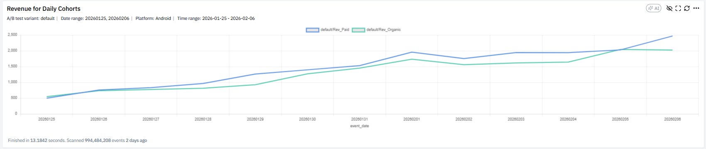
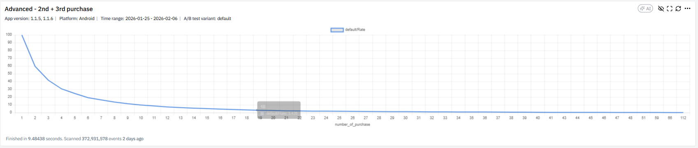
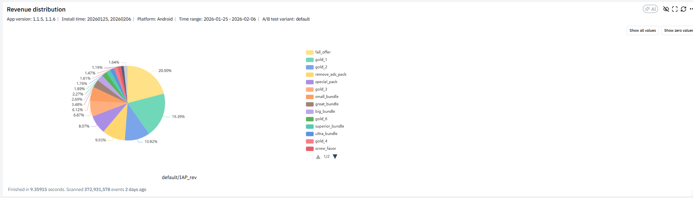

## Định Nghĩa

Monetization Dashboard là bộ 9 chart phân tích doanh thu game theo XGAME, theo dõi cả IAP (in-app purchase) và Ads (quảng cáo). Mục đích: theo dõi tổng doanh thu, đánh giá chất lượng kiếm tiền per user, phân tích hành vi trả tiền, đo hiệu quả IAP/Ad conversion và RPI, kiểm tra cấu trúc revenue distribution.

Dashboard chia theo ba góc nhìn: tổng thể (chart 1–3), behavior (chart 4–6), structure & cohort (chart 7–9). Soft currency và Earn/Sink thuộc về [[economy-balance-dashboard|Economy dashboard]] khác — Monetization tập trung doanh thu thực (USD).

## 9 Chart Phân Tích

### 1. Revenue (IAP + Ads)

Theo dõi xu hướng `IAP_rev`, `IAA_rev` (doanh thu quảng cáo), và `Total_rev = IAP_rev + IAA_rev` theo ngày. Đọc xu hướng Total, so tỷ trọng IAP vs Ads, kiểm tra spike/drop bất thường. Câu hỏi: doanh thu tăng do user tăng hay ARPU tăng, ads có chiếm tỷ trọng quá lớn, version mới có làm giảm revenue không.

### 2. Basic — ARPDAU (IAP + Ads)

Đo chất lượng kiếm tiền trên mỗi user active. `IAP_ARPDAU = IAP_rev / DAU`, `Ad_ARPDAU = Ad_rev / DAU`, `Total_ARPDAU = Total_rev / DAU`. Câu hỏi điều tra: ARPDAU tăng do ARPPU tăng hay do conversion tăng, ARPDAU tăng do Ads hay IAP, ARPDAU có tăng sau update.

### 3. RPI (Revenue per Install)

Đo Revenue per Install theo retention day. `RPI = Tổng revenue từ cohort / số install cohort`. Đọc curve tích lũy: monetize nhanh hay chậm, có spike day 1–3 không. Câu hỏi: monetization tập trung early hay long tail, game có phụ thuộc whale không, có drop sau D30 không.

### 4. Daily IAP Conversion

`IAP_conversion = IAP_user / DAU`. So conversion theo ngày, theo version, trước/sau event. Câu hỏi: conversion có cải thiện sau update, có giảm do tăng giá không, whale có chiếm phần lớn revenue không.

### 5. Daily Ad Conversion

`Ad_conversion = Ad_watch_user / DAU`. So tỷ lệ xem ads, kiểm tra saturation, đối chiếu với retention. Câu hỏi quan trọng: có đang ép ads quá mức không, ads conversion tăng có làm retention giảm không. Liên hệ với [[rv-placement-strategy|RV placement]] — chart này verify slot RV mới có thực sự nâng watch rate.

### 6. Ads per DAU

`Ads_per_DAU = Total_ads / DAU`. Đo số ads trung bình mỗi user xem/ngày. Đối chiếu với `ARPDAU_Ads` và retention để phát hiện over-monetization. Câu hỏi: user có đang bị over-monetize, ads per DAU tăng có làm D1 retention giảm.

### 7. Revenue for Daily Cohorts

So sánh revenue Paid cohort vs Organic cohort. Câu hỏi: UA đang mang về user chất lượng không, paid cohort có pay tốt không. Áp dụng Method 4 ([[metric-diagnosis-4-methods|so sánh tham chiếu]]) trực tiếp giữa hai nguồn user.

### 8. Advanced — 2nd + 3rd Purchase

Phân tích depth of purchase. Tỷ lệ user có 2nd, 3rd, Nth purchase. Đọc curve giảm dần — drop mạnh từ purchase 1 → 2 là dấu hiệu game phụ thuộc first purchase, repeat purchase yếu. Câu hỏi: game có phụ thuộc first purchase không, repeat purchase rate bao nhiêu.

### 9. Revenue Distribution

Phân bổ revenue theo pack — % contribution của từng SKU. Top SKU chiếm bao nhiêu %, whale pack có dominate không, small bundle có đóng góp không. Câu hỏi điều tra: có quá phụ thuộc 1–2 pack không, whale risk cao không, remove_ads có đóng góp ổn định không.

## Liên Hệ / Ứng Dụng

Dashboard này là layer doanh thu thuần — bổ sung cho [[economy-balance-dashboard|economy dashboard]] (theo dõi soft currency Earn/Sink) và [[level-analytics-dashboard|level analytics]] (revenue per level). Khi áp dụng [[game-analytics-mindset|quy trình 6 bước]], chart 1 và chart 3 thường là entry point để định mục tiêu (bước 1), chart 4–6 phục vụ mô phỏng hành vi (bước 2–3), chart 8–9 phục vụ chốt action (bước 5).

Cảnh báo từ tài liệu: "Ads conversion tăng có làm retention giảm không" — khi đẩy `Ads_per_DAU` lên, phải song hành theo dõi D1/D7 retention trong [[retention-dashboard|retention dashboard]]. Tăng monetization mà không kiểm soát churn là pattern thất bại phổ biến.

## Nguồn Tham Khảo

- `raw/papers/XGAME_DA_ Hướng dẫn đọc phân tích các chart trong dashboard_Monetization.pdf` — XGAME DA Monetization guide, 7 trang
- Ảnh minh hoạ tại `monetization-dashboard.assets/`
