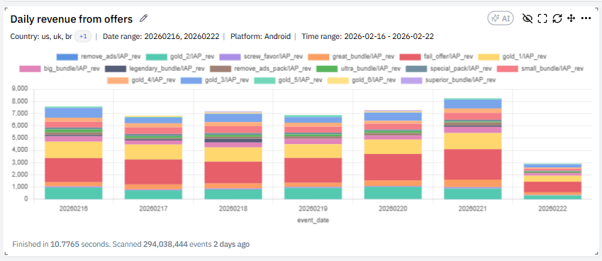
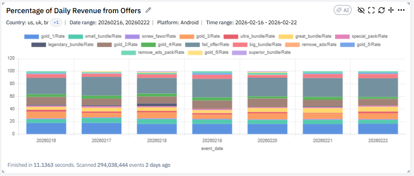
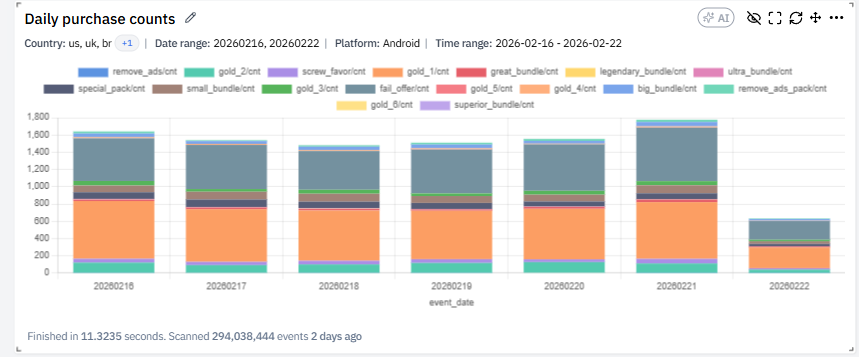
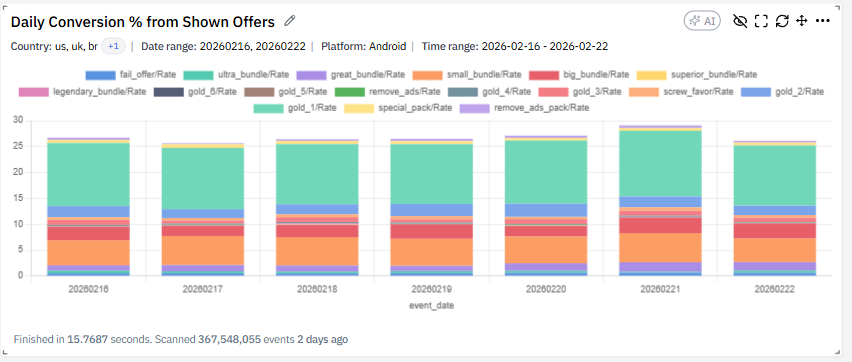
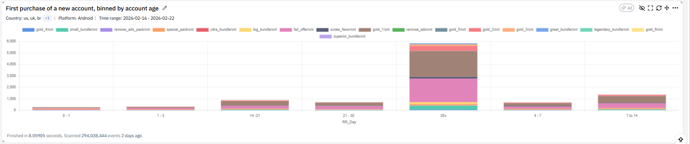

## Định Nghĩa

Offer System Dashboard là bộ 5 chart phân tích hiệu quả của hệ thống Offer/Pack trong game, mô tả trong tài liệu XGAME. Khác với [[monetization-dashboard|Monetization Dashboard]] đo doanh thu tổng, dashboard này tập trung **từng pack cụ thể**: pack nào tạo revenue cao nhất, pack nào được mua nhiều nhất, pack nào convert tốt khi shown, cơ cấu doanh thu có lệch không, người chơi mua offer đầu tiên ở giai đoạn nào.

## 5 Chart Phân Tích

### 1. Daily Revenue from Offers

Theo dõi doanh thu tuyệt đối theo ngày của từng Offer. `Revenue` = doanh thu từng gói offer. Đọc dạng stacked column: tổng chiều cao cột = tổng offer revenue/ngày, tỷ trọng màu cho biết offer nào dominate. So giữa các ngày để thấy offer mới nổi lên hay offer cũ giảm mạnh. Câu hỏi: big bundle có chiếm >40% revenue không, remove ads có ổn định không, sau event/AB test offer nào tăng mạnh.

### 2. Percentage of Daily Revenue from Offers

Tỷ trọng % doanh thu của từng Offer trong tổng revenue ngày. `Offer Revenue % = Revenue_offer / Total_offer_revenue`. Không nhìn số tuyệt đối, nhìn tỷ lệ %. Kiểm tra: offer nào chiếm >30% (whale risk), có biến động mạnh giữa các ngày không. Câu hỏi: nếu big_bundle chiếm 50% thì có whale risk không, gold pack nhỏ có đang được mua nhiều không.

### 3. Daily Purchase Counts

Số lượng giao dịch theo ngày của từng Offer. Khác với revenue, chart này phản ánh **volume bán** và độ phổ biến thực tế. So purchase count với revenue: offer revenue cao + purchase thấp → high price (whale-targeted); offer purchase cao + revenue thấp → low price (entry pack). Câu hỏi: offer nào được mua nhiều nhất, remove_ads có nhiều user mua không, gold_1 pack có phải entry pack chính.

### 4. Daily Conversion % from Shown Offers

`Conversion % = số user mua offer / số user được show offer`. Đo hiệu quả chuyển đổi khi offer hiển thị. Kiểm tra: offer nào convert tốt nhất, offer nào được show nhiều nhưng convert thấp. Câu hỏi: có offer nào bị spam show nhưng conversion thấp không (waste impression), offer giá cao có conversion quá thấp không. Đây là chart [[funnel-analysis|funnel]] thuần cho offer system: bottleneck giữa "shown" và "purchased".

### 5. First Purchase of a New Account (Binned by Account Age)

Phân tích thời điểm user thực hiện purchase đầu tiên. Bin theo Day 0–1, Day 1–3, Day 3–7, Day 7–14, Day 14–30, 30+. Đọc bucket có volume cao nhất: nếu 30+ lớn → game monetize late; nếu 0–3 thấp → thiếu starter offer. Câu hỏi: bao nhiêu % first purchase trong 7 ngày đầu, có thiếu early funnel không, whale thường mua ở giai đoạn nào.

## Liên Hệ / Ứng Dụng

Dashboard này là zoom-in chi tiết của [[monetization-dashboard|Monetization Dashboard]] chart 9 (Revenue Distribution) — thay vì chỉ thấy "% contribution per pack", Offer System cho biết hành vi đằng sau con số đó. Chart 4 (Conversion %) là [[funnel-analysis|funnel]] một-bước hoàn chỉnh; Chart 5 (First Purchase) áp dụng Method 2 ([[metric-diagnosis-4-methods|bóc tách dimension theo account age]]) để hiểu monetize early vs late.

Pattern điều tra phổ biến từ tài liệu: phát hiện "1 pack chiếm >30%" qua chart 2 → kiểm tra chart 4 xem pack đó có conversion bất thường không → kiểm tra chart 5 xem pack đó có ảnh hưởng đến early/late buyer khác nhau không. Action có thể là tách thành nhiều SKU nhỏ hoặc thêm pack tiered để giảm whale dependency.

## Nguồn Tham Khảo

- `raw/papers/XGAME_DA_ Hướng dẫn đọc phân tích các chart trong dashboard_Offer System.pdf` — XGAME DA Offer System guide, 5 trang
- Ảnh minh hoạ tại `offer-system-dashboard.assets/`
