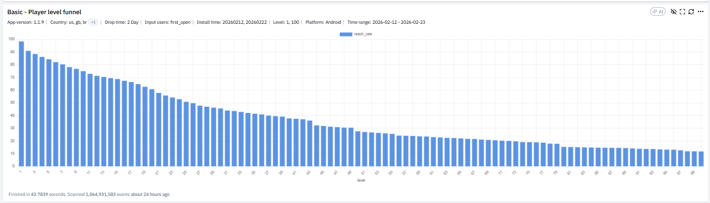
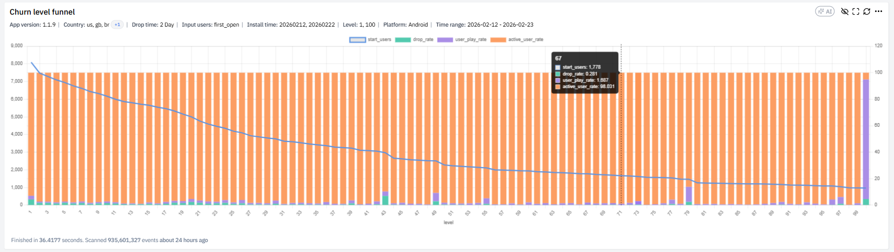
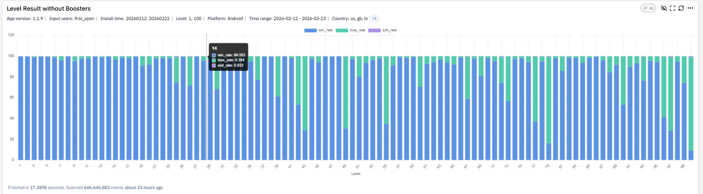
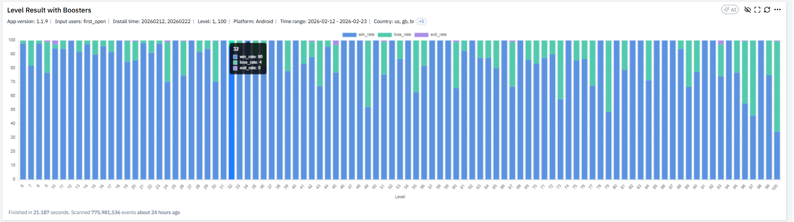
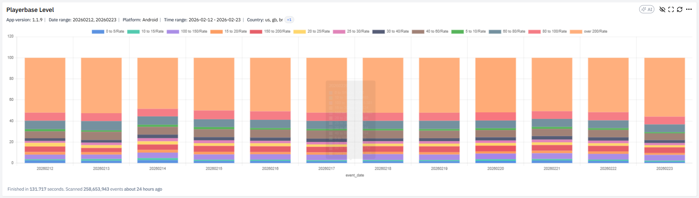
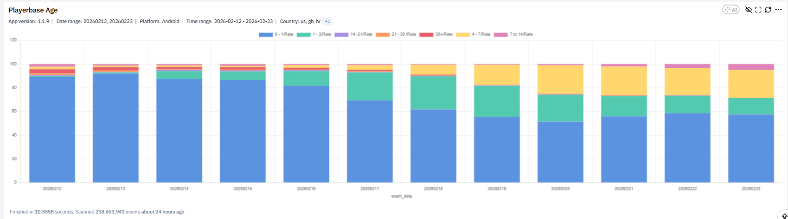

## Định Nghĩa

Player Journey Dashboard là bộ 6 chart phân tích toàn bộ hành trình người chơi qua các level, mô tả trong tài liệu XGAME. Trả lời các câu hỏi cốt lõi: người chơi rơi rụng ở level nào, level nào gây choke-point, booster có thực sự giúp vượt level không, game đang bị hard ở early/mid/late, playerbase đang tập trung ở stage nào.

Khác với [[level-analytics-dashboard|Level Analytics]] tập trung 22 chỉ số chi tiết per level, Player Journey nhìn ở góc độ **funnel tổng** và **distribution** — vĩ mô hơn nhưng vẫn ở granularity level.

## 6 Chart Phân Tích

### 1. Basic — Player Level Funnel

Theo dõi `Reach Rate (%) = Số user đạt level X / Tổng user FO`. Curve retention theo progression. Đọc độ dốc: dốc mạnh → game khó, dốc nhẹ → progression mượt. Xác định điểm tụt mạnh bất thường. Câu hỏi: level nào mất >5% reach bất thường, mid-game có drop quá nhanh không, version mới có làm curve dốc hơn không. Đây là [[funnel-analysis|funnel]] chuẩn cho retention theo level — liên hệ trực tiếp với [[ftue-curve|FTUE curve]] (20–25 level đầu).

### 2. Churn Level Funnel

Phân tích chi tiết `Drop_rate`, `User_play_rate`, `Active_user_rate` theo từng level — tìm chính xác level gây churn. `Drop_rate` = user không còn hoạt động trong X ngày và level lớn nhất họ đạt được. Đọc spike `drop_rate`, đối chiếu với `win_rate`, kiểm tra level có drop > trung bình. Câu hỏi: level nào có drop_rate cao nhất, drop có trùng với level khó, drop có xảy ra sau fail streak.

### 3. Level Result without Boosters

Win/Lose/Exit rate khi user **không dùng booster**. `win_rate < 50%` → level khó; `lose_rate` cao liên tục → frustration risk; `exit_rate` cao → UX có vấn đề. Câu hỏi: nếu win quá thấp so với kịch bản GD → giảm difficulty; nếu exit cao → kiểm tra crash hoặc UX.

### 4. Level Result with Boosters

Win/Lose khi user **có dùng booster** — so sánh trực tiếp với chart 3 để đánh giá hiệu quả booster. Threshold theo tài liệu: chênh lệch `win_rate` >15% hoặc `WinRate >= 90%` → booster hiệu quả. Chênh lệch nhỏ → booster yếu. Câu hỏi: booster có cứu được level choke không, có level mà booster vẫn win thấp không. Liên hệ với [[booster-design-puzzle|booster design framework]] — chart này là test thực tế xem combo PA/SE/RD đang hoạt động đúng không.

### 5. Playerbase Level

Phân bố `% user active` theo level bucket theo ngày. Game đang có nhiều early player hay late player, playerbase dịch chuyển thế nào theo thời gian. Đọc tỷ trọng bucket lớn nhất: nếu >50% ở level thấp → churn sớm; nếu dịch chuyển dần lên bucket cao → progression healthy. Câu hỏi: có bị kẹt mid-game không, có tăng tỷ lệ late player không, sau update level mới có dịch chuyển không.

### 6. Playerbase Age

Phân bố user theo `account age` (`% DAU` per retention day). Game có giữ được long-term player không, có phụ thuộc new user không. Threshold tài liệu: nếu 0–3 chiếm >70% → phụ thuộc UA; nếu 30+ tăng → retention tốt. Câu hỏi: nếu phụ thuộc new user → tối ưu D7–D30; nếu long-term tăng → đầu tư endgame.

## Liên Hệ / Ứng Dụng

Player Journey là dashboard **diagnostic** đầu tiên khi retention biến động. Quy trình áp dụng [[metric-diagnosis-4-methods|4 phương pháp chẩn đoán]]: thấy retention rớt → chart 1 (Player Level Funnel) tìm level nào tụt → chart 2 (Churn Level Funnel) confirm level đó có drop_rate spike không → chart 3+4 (Result with/without Boosters) kiểm tra booster có giải quyết được không → quyết định action.

Khi áp dụng [[hard-level-design|hard level design]], chart 1 và chart 2 verify hard level có hoạt động đúng không. Hard level theo Lion Studios là "currency sink để trigger booster/revive" — nếu chart 4 không cho thấy `win_rate` boost với booster, hard level đang trở thành choke point thật. Chart 5 (Playerbase Level) là proxy cho [[level-funnel-heartbeat|heartbeat pattern]] — distribution dịch chuyển smooth theo thời gian là dấu hiệu pacing đúng.

## Nguồn Tham Khảo

- `raw/papers/XGAME_DA_ Hướng dẫn đọc phân tích các chart trong dashboard_Player Journey.pdf` — XGAME DA Player Journey guide, 6 trang
- Ảnh minh hoạ tại `player-journey-dashboard.assets/`
