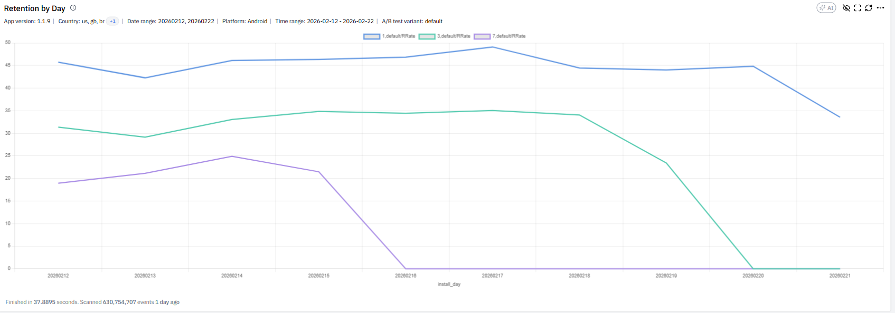
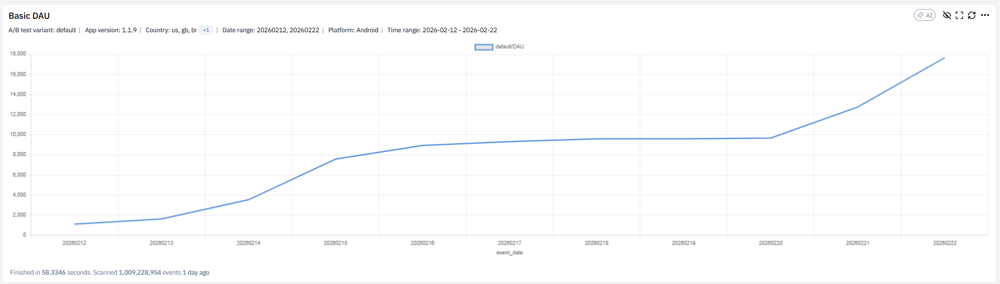
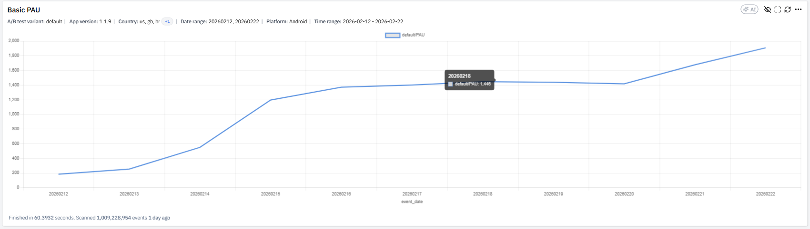
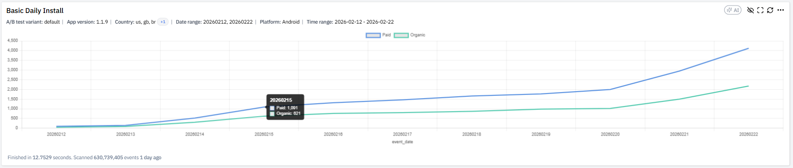
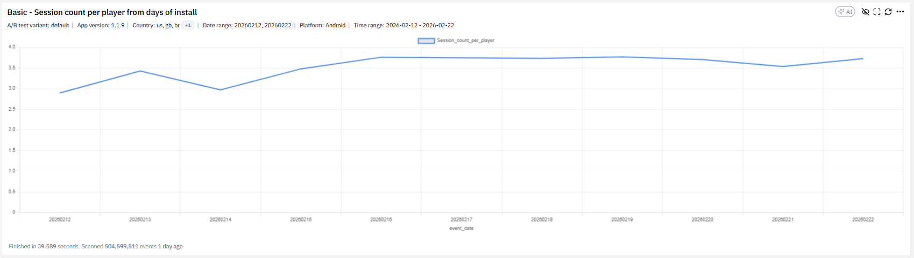
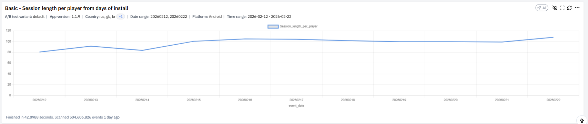

## Định Nghĩa

Retention Dashboard là bộ 6 chart theo dõi chất lượng giữ chân người chơi sau khi install, mô tả trong tài liệu XGAME. Trả lời hai câu hỏi cốt lõi: user có quay lại game không, user quay lại với mức độ engagement thế nào.

Dashboard phát hiện sớm bất thường về retention do bốn nguyên nhân chính theo tài liệu: version mới gây regression, AB test có effect tiêu cực, traffic chất lượng thấp từ UA, và tracking lỗi.

## 6 Chart Phân Tích

### 1. Retention by Day

Theo dõi `D1 = users active D1 / users install D0`, `D3`, `D7` theo từng `install_day` (cohort). Trục X = install_day, trục Y = retention rate %, ba đường D1/D3/D7. So sánh chất lượng user giữa các cohort, phát hiện cohort bất thường. Tài liệu cảnh báo: "Cohort gần hiện tại sẽ chưa đủ D7 → retention có thể = 0 (do chưa tới ngày). Không hiểu nhầm 0% là retention xấu." Câu hỏi: D1 có giảm theo thời gian không, D3/D7 có gap bất thường so với D1, cohort nào đột ngột drop.

### 2. Basic DAU

`DAU = số user unique active trong ngày`, theo `event_date`. Theo dõi xu hướng tăng trưởng user base. Câu hỏi: DAU tăng do install tăng hay retention tốt, có spike bất thường không, có ngày drop mạnh không. DAU phải được đọc cùng [[monetization-dashboard|ARPDAU]] và Daily Install (chart 4) để phân biệt growth vs churn.

### 3. Basic PAU

`PAU = số user có phát sinh revenue trong ngày`. Đánh giá health của monetization base. Tài liệu nhấn mạnh: "PAU luôn phải phân tích cùng DAU." Câu hỏi: PAU tăng có tương ứng với DAU tăng không, conversion rate có thay đổi, có ngày revenue spike do whale không. Liên hệ với [[monetization-dashboard|IAP Conversion]] — PAU/DAU = IAP conversion rate.

### 4. Basic Daily Install

Theo dõi install theo ngày, chia `Paid Install` (có attribution paid) và `Organic Install`. Câu hỏi: install tăng do Paid hay Organic, paid tăng có kéo retention xuống không, có ngày spike bất thường không. Đối chiếu với chart 1 (Retention by Day) để phát hiện UA traffic chất lượng thấp — nếu Paid spike trùng cohort drop retention thì source UA có vấn đề.

### 5. Session Count per Player from Days of Install

`Session_count_per_player = Tổng session / số user active`. Đo engagement theo số session trung bình/user. Câu hỏi: user có chơi nhiều hơn không, version mới có làm tăng session frequency không, có dấu hiệu fatigue không.

### 6. Session Length per Player from Days of Install

`Session_length_per_player = Tổng playtime / số user active`. Đo thời gian chơi trung bình/user, đánh giá depth engagement. Tài liệu cung cấp ma trận diễn giải khi kết hợp với chart 5 (session count):

| Session count | Session length | Ý nghĩa |
|---------------|----------------|---------|
| Cao | Cao | Game hấp dẫn |
| Cao | Thấp | Nhiều session ngắn (snacking) |
| Thấp | Cao | Ít nhưng dài (deep session) |
| Thấp | Thấp | Engagement giảm |

Câu hỏi: user spend nhiều thời gian hơn không, có dấu hiệu burnout không, update mới có ảnh hưởng playtime không.

## Liên Hệ / Ứng Dụng

Retention Dashboard là điểm khởi đầu cho hầu hết phân tích trong [[game-analytics-mindset|quy trình 6 bước]] — KPI mục tiêu (D1, D7) đều ở đây. Khi retention biến động, áp dụng [[metric-diagnosis-4-methods|4 phương pháp chẩn đoán]]: chart 1 áp dụng Method 1 (timing — cohort nào drop từ ngày nào), chart 4 áp dụng Method 2 (bóc tách Paid vs Organic), chart 5+6 áp dụng Method 3 (chỉ số liên quan — session count tỷ lệ với retention).

Sau khi confirm retention rớt qua dashboard này, drill-down sang [[player-journey-dashboard|Player Journey]] để tìm chính xác level nào gây churn, sau đó sang [[level-analytics-dashboard|Level Analytics]] để hiểu nguyên nhân (độ khó, booster, ad placement). Đây là chu trình diagnostic chuẩn cho retention issue.

Nguyên tắc tài liệu nhấn mạnh: PAU không nên đọc một mình — luôn cùng DAU. DAU tăng + PAU không tăng → retention tốt nhưng monetization yếu. PAU tăng + DAU đứng → conversion rate tăng (tích cực) hoặc whale-driven (rủi ro).

## Nguồn Tham Khảo

- `raw/papers/XGAME_DA_ Hướng dẫn đọc phân tích các chart trong dashboard_Retention.pdf` — XGAME DA Retention guide, 5 trang
- Ảnh minh hoạ tại `retention-dashboard.assets/`
